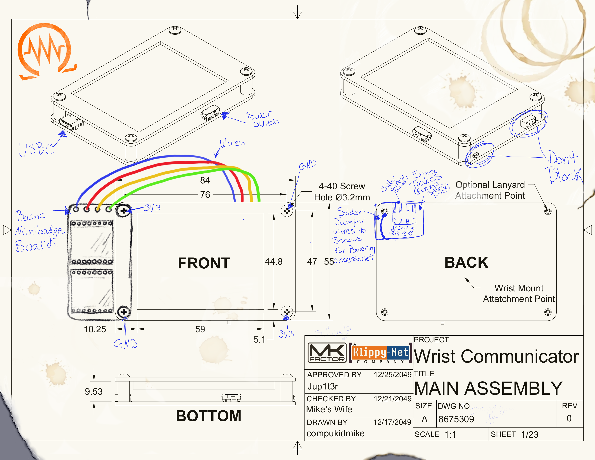

# Saintcon 2024

## We found an old engineering drawing from MK Factor. It looks like someone did some reverse engineering on the original Klippy-Net Wrist Communicator. I wonder if we can use this in our fight against the evil Klippy AI...

## We also came across this press release...

## In all seriousness...
We don't normally release badge information before the conference, but we have some exciting new things this year and we want people to have the opportunity to make some cool additions to the badge.

## Klip-ons
You may have noticed in the "Engineering Drawing" above that the screws are labeled 3V3 and GND. The idea is that you can make "klip-on" (get it? Klippy.. Klip-on.. Yeah you get it) boards that get power from the screws that attach them to the badge.

We've provided KiCad libraries to help you get started (You'll find them in the Klip-ons directory).  
There's a schematic symbol for the power connections and 4 footprints for Left/Right/Upper/Lower Klip-ons. The footprints include the outline of the top of the badge for reference, as well as a simple board outline. You can remove it if you'd like to make your own shape. Just be sure to avoid covering the screen on the badge. The footprints also have keepout areas to help you avoid putting parts on the bottom side of your klip-on where it would interfere with the badge itself.

<b>Please note that the screen opening is NOT centered on the badge.</b> That was a huge oversight on my part but now we're stuck with it. That's why the KiCad footprints include an outline of the entire top of the badge with the screen opening. This becomes an issue because the badge can be flipped over to wear it on the other wrist. Please try to make your klip-ons not interfere with the screen opening in either orientation.

## Wrist Mount
We wanted to do something different this year, so this baby is wrist mounted! We'll provide a soft wristband (sweatband) that has velcro on it. If you'd like to wear your badge on your wrist, simply attach the other side of the velcro to the back of your badge. If you'd prefer to stick with a lanyard, we've got a plan for that as well.

The wristband will have the "rough" hook side of the velcro and the badge will have the soft loop side. This will hopefully avoid shirt damage if you decide to switch to lanyard mount during the conference.

## Minibadges
Every badge will come with a two-slot minibadge klip-on board similar to the one in the drawing. If you'd like to make your own minibadge klip-on board, you can find an example KiCad board in the Klip-ons directory. You can add more minibadge slots, but we suggest that you only connect the I2C lines to two slots. The badge only supports two official game minibadges at a time and they must be in the two slots that are connected to I2C. You can add more minibadge slots that just have power for displaying extra minibadges.

If you decide to make your own minibadge klip-on, you may notice that the I2C lines are labeled funny. This was done to cut down on the number of wires needed to connect the minibadges. Please keep the I2C connections as they are in the schematic so that your board will work. If you have questions about your board, feel free to reach out on discord and we'd be happy to look at it.

## Minibadge Extensions
We're sure some of you noticed that the "standard" 20-Pin minibadge extension connector isn't anywhere to be found on this badge. Rest assured that we didn't forget/abandon it (yet). Every badge will come with a minibadge expansion board that has a spot for the 20-Pin connector. It will have 8 minibadge slots and go on a lanyard like previous badges. *"But how will it be powered?,"* we hear you asking... well, that USB-C port on the badge happens to be able to supply power! There's no guarantee that the battery will last very long when you connect all the blinky lights, but that's the price you pay for wanting to blind everyone with your awesomeness!  
NOTE: The minibadge expansion board will NOT have I2C connected to the badge.

## But I don't know how to create a circuit board
Neither did we when we started. Everyone starts somewhere and there are resources to get you making circuit boards in no time! The software is all free/open source and we even have some video tutorials! 

### Videos
https://www.youtube.com/watch?v=kkLfmo14oiQ  
https://www.youtube.com/watch?v=oAkId60DOd4  
https://www.youtube.com/watch?v=VVd4cdz-lU0  

### Software
https://www.kicad.org/  
https://inkscape.org/  

# Now go create something awesome!
If you run into any problems or have questions, please reach out on the Saintcon discord.

# FAQs
<b>Q: What more information can you tell me about the badge?</b>  
A: I'm afraid what has been released, is what you get. It's more than you normally see anyway.  

<b>Q: But, I really want to do X with the badge, can I do it?</b>  
A: Again, if it works with what has been released, you bet. Go nuts  

<b>Q: Ok, but I REALLY want to have my minibadge interface with the badge game and do something special.</b>  
A: That's not a question, but let's start with the first bit there. Who told you there was a "game"?  

<b>Q: Oh...uhh...I suppose...I just assumed.</b>  
A: Again, not a question...you know how these work right?  

<b>Q: Why can't you support {super cool integration} it'll be awesome!</b>  
A: I'm sure it would be! The reality of the situation is trying to coordinate yours (and everyone elses) cool integrations puts a tremendous amount of stress / work on a small volunteer team that is already running at near capacity. Maybe in the future we'll have a cool framework / spec to make this seamless.but that's just not today.  

<b>Q: Ok, that's fair....so...is there a badge game or not?</b>  
A: ... Schmaybe ...  

<b>Q: Does v0rtex ever wear colors besides black?</b>  
A: Yes, once he wore a green shirt. It was a momentous occasion.  

<b>Q: What is the badge's team secret? What keeps them going?</b>  
A: Little Caesars pepperoni pizza puff thingies... If you haven't tried them...you really... actually...right now...order them. Then return and report.  
